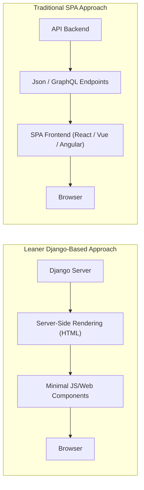
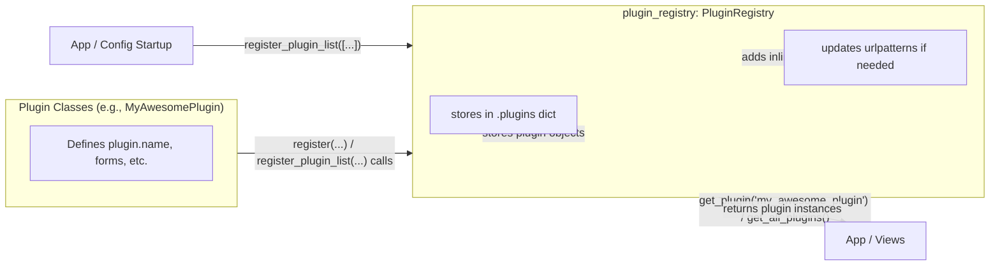

# Building a Django Resume Project

## Introduction

### Motivation: The complexity of SPAs versus the elegance of a lean Django app

> Developers are drawn to complexity like moths to a flame, often with the same result. --Neal Ford

The web development world often finds itself caught between two extremes: the sleek, dynamic allure of Single Page
Applications (SPAs) and the simplicity and reliability of traditional server-side rendering. SPAs, with their app-like
experiences and fluid interactions, have become the default choice for many modern developers. They promise user
experiences that are seamless and responsive, but achieving these benefits often comes with a steep cost: complexity.

Managing an SPA means maintaining separate frontend and backend systems, dealing with API design intricacies, and
navigating the challenges of state management and hydration. These layers of complexity can create significant overhead,
especially for projects that don’t inherently require such architectural depth.

This is where Django—paired with modern tools like htmx—offers an elegant alternative. By embracing server-side
rendering while strategically integrating small, focused JavaScript enhancements, you can create applications that are
interactive, fast, and visually appealing, all without the sprawling complexity of an SPA. The django-resume project
arose from this exact motivation: to demonstrate how a lean Django app could meet the same non-functional requirements
as an SPA while remaining simple and maintainable.

By focusing on the power of Django and server-side rendering, this project highlights the possibilities of combining
modern web techniques with a "back to basics" approach, challenging the notion that SPAs are the only way to deliver
modern web experiences.

## The birth of django-resume: A side project to manage resumes with simplicity

> I have been asked to stop referring to LinkedIn as "Grindr for
> Business" --[ncl](https://corteximplant.com/@ncl/112636282694430649)

As a freelance developer, I’ve often faced the challenge of keeping my professional profile updated across multiple
platforms like LinkedIn, freelancer websites, and personal portfolios. Each platform has its quirks, and ensuring
consistency across them quickly becomes tedious. What I really needed was a single, centralized source of truth for my
resume—a system that I could update once and share everywhere.

Inspired by the simplicity and control of managing my own tools, I decided to create django-resume. The goal was clear:
to build a modern, customizable resume management system that leveraged Django’s strengths without introducing
unnecessary complexity. I wanted a solution that was:

- **Lean and maintainable**, avoiding the overhead of SPAs.

- **Flexible**, to accommodate diverse professional needs.

- **Extensible**, allowing others to easily adapt it to their requirements.

The project started as a straightforward attempt to address a common problem: maintaining consistency across multiple
platforms for my professional profile. However, it quickly became apparent that django-resume could evolve into
something more significant—a practical framework for building interactive and extensible web applications using Django,
htmx, and modern development principles.

## Why SPAs Dominate Today

### Non-functional Requirements Driving SPA Popularity

Let’s be honest: the modern obsession with SPAs isn’t really about technical necessity—it’s about perception. SPAs are
flashy, they feel fast, and they look great in demos. Developers and product managers alike are drawn to the promise of
silky-smooth interactions and app-like experiences. And why not? Who wouldn’t want their web app to feel like a native
application?

But here’s the catch: these "must-have" qualities—fast interactions, good-looking designs, and seamless user
experiences—are not inherently tied to SPAs. They’re tied to effort and good implementation. SPAs just happen to have
marketing momentum, fueled by the ecosystem around them. JavaScript frameworks promise to make your app "modern" and "
responsive," but at what cost? The complexity they introduce often dwarfs the benefits.

The non-functional requirements driving this trend are:

- **Smooth user experience**: Instant feedback and dynamic updates make interactions feel snappy.

- **Appealing visuals**: SPAs encourage developers to adopt the latest front-end technologies to wow users.

- **Developer experience**: The component-based architecture of modern frameworks feels flexible and modular.

It’s all very convincing—until you remember that most of these goals can be achieved with far less complexity if you’re
willing to work within the capabilities of tools like Django and htmx. SPAs solve problems, sure, but they also create
plenty of new ones along the way.

### Challenges Introduced by SPAs

SPAs might promise simplicity on the surface, but under the hood, they’re juggling a lot. The architecture they require
can turn even a simple project into a high-wire act. Let’s break it down:

#### Architectural Complexity

At their core, SPAs are complicated systems. You’re not just building a website; you’re essentially maintaining a mini
operating system in the browser. The frontend needs to handle routing, state management, and rendering—things that
server-side frameworks traditionally take care of. Add in the need for API endpoints, caching strategies, and
authentication, and you’ve suddenly got yourself a web of interdependent parts that all need to work flawlessly
together. Simple task? Think again.

#### Specialized Frontend-Backend Separation

SPAs enforce a hard divide between the frontend and backend, which often means separate teams, tools, and workflows.
This can lead to communication gaps, as frontend developers might not fully understand backend constraints, and vice
versa. Plus, maintaining APIs that satisfy both the frontend’s appetite for real-time data and the backend’s need for
stability can be a delicate balancing act.

#### Inefficiencies in Workflows

Let’s face it: SPAs aren’t exactly known for being developer-friendly—at least not in the long run. Every little change
can cascade through the system, requiring updates to multiple layers. Want to tweak how a button works? That might mean
touching the frontend logic, updating API endpoints, and ensuring the backend schema still aligns. What could have been
a five-minute job in a server-rendered app turns into an afternoon of debugging.

While SPAs undoubtedly have their place for certain types of applications, these challenges show that they aren’t the
universal solution they’re often marketed to be. Sometimes, simpler really is better.

## Achieving Non-Functional Requirements Without SPAs

The assumption that only SPAs can deliver a smooth, modern web experience is deeply ingrained, but it’s also flawed.
With the right tools and techniques, you can meet these non-functional requirements without surrendering to the
complexity of SPAs. Let’s break it down:

### Interactivity with htmx

htmx is like the quiet overachiever of modern web development. It doesn’t shout about its capabilities, but it quietly
enables dynamic updates, partial page refreshes, and seamless interactivity—all while keeping the server in charge. Need
a button to update part of the page without a reload? Add an hx-get or hx-post attribute, and you’re done. No need for
complicated JavaScript frameworks or state management libraries. It’s the web as it was meant to be: straightforward.

### Advanced CSS Techniques

Modern CSS has come a long way, offering powerful features like CSS variables, container queries, and grid layouts.
These tools enable developers to create stunning, responsive designs without relying on JavaScript-heavy solutions.
Animations? Transitions? Dark mode? CSS handles them effortlessly.

Frameworks like Tailwind CSS provide a convenient way to build isolated components, but they come with limitations.
Tailwind focuses on styling individual elements directly through utility classes, which can lead to verbose markup and
limited flexibility. A more modular approach is outlined in the book "Every Layout," which promotes building complex
layouts from simple CSS primitives like "The Box," "The Stack," and "The Center." For example, "The Stack" demonstrates
how to style the space between sibling elements using the lobotomized owl operator. This technique allows developers to
manage relationships between elements, not just the elements themselves.

Unlike Tailwind, the "Every Layout" approach doesn’t require a build pipeline or a watcher process for HTML changes. It
also fully leverages CSS features, including the cascade, enabling shared styles to propagate naturally through the
document hierarchy. This method reduces duplication, simplifies maintenance, and makes it easier to adapt designs to
changing requirements. By embracing these principles, you gain more control and flexibility, using all the capabilities
of CSS without the overhead of additional tooling. The days of relying on SPAs or excessive frameworks for polished UI
are over—modern CSS has all the tools you need.

### Performance

Server-side rendering (SSR) is still the king when it comes to performance. By rendering pages on the server and
delivering fully-formed HTML to the browser, you ensure fast load times, excellent SEO, and accessibility out of the
box. Combine SSR with htmx for interactivity, and you’ve got a solution that feels as fast as an SPA but without the
bloated JavaScript payload.

### Developer Simplicity

One of the most underrated benefits of avoiding SPAs is how much simpler development becomes. No need to split your
brain between frontend and backend logic or juggle two separate toolchains. Everything’s in one place, making it easier
to understand, debug, and maintain. Developers can focus on building features instead of wrestling with framework
quirks.

With these approaches, django-resume delivers a modern web experience that rivals SPAs in interactivity and design but
remains lean and manageable. It’s proof that sometimes less really is more.

## Building Extensible Functionality: Plugin Architecture

### Addressing Diverse Needs in Resume Systems

Up until now, we’ve focused on non-functional requirements—like interactivity, performance, and simplicity—that apply
broadly to modern web applications. But resume management comes with its own set of functional requirements that are
just as critical. These requirements vary widely depending on the professional using the system.

Different professions demand distinct features to effectively present their work:

- **Software Developers** like me often need a project portfolio that highlights key achievements and provides detailed
  descriptions of past work. A timeline of to show progression can be particularly useful.

- **Academics** require dedicated sections for publications, research projects, teaching experiences, and conference
  presentations.

- **Designers** favor image-heavy portfolios to showcase their visual creativity and design aesthetics.

- **Musicians** might prioritize audio samples, albums, and performance details to highlight their work.

These varied needs present a challenge: how can a single system accommodate such diverse requirements without becoming
overly rigid or bloated? For a personal side project like django-resume, trying to build a monolithic solution with
prebuilt sections for every possible use case would simply be too much. Such an approach risks alienating users with
unnecessary complexity or insufficient customization, while also overwhelming the project’s development scope.

A plugin-based architecture seems like the right solution to this problem. It focuses on extensibility, allowing users
to add only the features they need, tailored to their specific professional requirements. The transition from
non-functional requirements to functional ones highlights the need for flexibility in both design and functionality to
handle a variety of professional use cases effectively.

### Plugin-Based Architecture for Flexibility

In django-resume, the goal was to keep the system simple and flexible without unnecessary complexity. A plugin-based
architecture emerged as a practical way to achieve this. Instead of packing the core system with every possible feature,
this approach allows developers to add only the functionality they need. No bloated defaults, no over-engineering—just a
straightforward, adaptable foundation. Here’s how it works:

#### Using JSONField as the Core Data Store

Let’s talk storage. While relational databases are fantastic, they can quickly become overly complex when every plugin
introduces its own schema. For django-resume, the goal was to allow plugins to be added without requiring migrations or
schema changes. A central JSONField in the main resume model makes this possible.

By keeping all plugin data in one place, the system avoids the challenges of querying multiple tables scattered across
different plugins. Sure, it’s possible to gather everything with complex joins or small queries chained together, but
that approach is more trouble than it’s worth. With a JSONField, all the data for a resume is available in a single
query, and given that a resume’s data is unlikely to exceed a few hundred kilobytes, reading it all at once is
efficient.

This setup prioritizes simplicity and performance. Adding a new plugin is as straightforward as storing its data under a
unique key in the JSONField—no migrations, no schema debates, no headaches. And while more complex schemas are sometimes
necessary, this isn’t one of those cases. For django-resume, JSONField hits the sweet spot of flexibility and
practicality without overcomplicating things.

#### Django Forms for Validation and Structure

Of course, just because we’re dumping data into JSON doesn’t mean validation can be ignored. Each plugin uses a Django
Form to define the rules for what kind of data it accepts. This approach ensures that all input data is structured,
valid, and—critically—JSON-serializable, as it needs to be stored in the JSONField. Django Forms provide a
straightforward and reliable way to handle this validation, so there’s no need to reinvent the wheel for every plugin.

#### Template-Based Rendering for Clean Separation

Finally, we come to rendering. Each plugin is responsible for providing its own templates. This keeps the presentation
layer cleanly separated from the data and logic. The system grabs the plugin’s data from the JSONField, hands it over to
the plugin’s template, and voilà—a perfectly customized section of the resume. No messy template overrides or hardcoding
required.

This approach ensures that plugins remain self-contained and manageable. Each plugin operates independently within the
system, with django-resume providing the infrastructure to tie everything together. The focus is on
practicality—avoiding unnecessary complexity while ensuring the system works reliably for its intended purpose.

### Key Components of the Plugin System

The plugin system in django-resume is designed to be as lightweight and straightforward as possible while providing the
necessary flexibility for customization. Here are its key components:

#### Minimal Requirements for Plugin Development

Developing a plugin for django-resume requires only three things:

1. **Templates**: Each plugin must provide its own template for rendering. This ensures that the visual presentation is
   entirely customizable without interfering with the core system or other plugins.

2. **Forms**: Plugins need a Django Form to handle input validation. This guarantees that any data saved to the system
   is structured and valid, and ensures compatibility with the JSONField storage.

3. **Unique** Plugin Names: Each plugin is identified by a unique name, which acts as its key in the central JSONField.
   This prevents data conflicts and ensures that plugins operate independently.

By keeping these requirements minimal, the system reduces the barrier to entry for plugin development while maintaining
consistency and reliability.

## Web Components: Simplifying the UI

Web Components are a practical solution for managing complex UI interactions in django-resume. By encapsulating
functionality into reusable, self-contained elements, they simplify development and reduce the need for custom
JavaScript-heavy solutions. Here’s how they fit into django-resume:

### Rethinking Form Handling with Content-Editable Elements

Traditional forms in web development often require rigid structures and significant boilerplate and come with their own
complexities. Everybody who has had to use django-crispy-forms or write form templates by hand knows what I mean. In
django-resume, contenteditable elements are used to avoid requiring plugin developers to create additional form
templates or worry about styling. These elements allow users to edit content directly on the page while staying
connected to the underlying form logic. This minimizes the overhead for developers while ensuring flexibility for users.

### Key Web Components in django-resume

There are two main Web Components used in django-resume, each tailored to specific functionality:

#### BadgeEditor: Managing Dynamic Lists

The BadgeEditor Web Component is designed to handle dynamic lists, such as the skills list or tags in the projects
plugin. While it’s technically possible to make a server request for every addition or removal, this approach
complicates backend logic and introduces unnecessary views and processing steps. The BadgeEditor keeps the list entirely
client-side until the user explicitly saves their changes. Users can add, edit, or remove items in real time, and when "
save" is clicked, a single request sends all updates to the server. This simplifies backend operations while making the
UI more responsive and user-friendly.

#### EditableForm: Connecting Content-Editable Elements to Hidden Forms

The EditableForm Web Component acts as the backbone for form handling. It connects contenteditable elements to hidden
form fields, ensuring synchronization and integration with Django’s server-side validation. This component is versatile
and used for most forms in django-resume, but it’s not mandatory for simpler cases where it might be overkill. Here’s
how it works:

1. **Live Updates**: Changes to contenteditable elements are immediately reflected in the corresponding hidden form
   fields, keeping the data consistent without requiring full-page reloads.
2. **Validation Integration**: When the form is submitted, Django processes the data, and any validation errors are
   returned to the Web Component. These errors are displayed inline, maintaining a user-friendly interface.

### Why Not Just Use SPAs?

It’s a valid question: If you’re already using frontend components, why not go all-in with something like React or
Vue.js? After all, they provide more powerful tools, better abstractions, and a more streamlined development experience.

The answer lies in simplicity and longevity:

- **No Extra Overhead**: Web Components are built into the browser. There’s no need to download a large JavaScript
  bundle or manage dependencies. This reduces page load times and avoids the complications of maintaining a frontend
  framework.

- **Durability**: Web Components rely on web standards. They don’t break after a few months of neglect while you’re busy
  with other projects. You don’t need a build pipeline, Node.js, or a sprawling node_modules folder. It works now, and
  it’ll work years from now.

- **No Lock-In**: Unlike SPAs tied to specific frameworks, Web Components are universally supported. This keeps the
  system flexible and avoids tying your project to the lifecycle of a particular JavaScript library.

By leveraging Web Components, django-resume achieves a balance between simplicity and modern functionality. They reduce
backend complexity, eliminate the need for additional frameworks, and provide a resilient foundation for the UI. While
SPAs might offer more power, Web Components deliver exactly what’s needed—no more, no less.

## Leveraging LLMs for Automation and Content Creation

### Generating Structured JSON Output for Content

LLMs are widely recognized for their ability to generate content, but what makes them particularly valuable for
django-resume is their precision in producing structured data in specific formats. For example, the JSON format used to
store plugin data in django-resume can be replicated effortlessly by providing the LLM with an example JSON snippet.
Instead of copying content from the website, pasting it into a chat interface, and then reformatting the response into
JSON, you can simply include a sample JSON structure and instruct the LLM to use the same format for its output. This
eliminates unnecessary steps, ensuring the content is immediately usable and consistent with the system’s requirements.
It’s not flashy, but it’s practical and saves time.

### Automating Plugin Code Creation with Few-Shot Learning

Here’s where things get really interesting: LLMs excel at automating plugin development in django-resume through
few-shot learning. Since django-resume already includes several plugins, it’s straightforward to extract pairs of "
prompt, plugin" examples from the existing codebase. These pairs can then be used as context for the LLM, enabling it to
generate new plugins effortlessly.

For instance, a prompt might describe a new plugin, such as "Create a plugin for adding certifications with fields for
certification name, issuer, and date." By including examples of how similar plugins are structured, the LLM can produce
a fully functional plugin with the correct form, template, and registry setup. This approach not only speeds up
development but also lowers the barrier to entry for developers who are new to django-resume. You don’t need to be
deeply familiar with the system’s internals; the LLM handles the heavy lifting, allowing you to focus on specifying the
plugin’s functionality.

The results are surprisingly effective, often requiring only minor adjustments or refinements. This makes it possible to
expand django-resume’s functionality quickly and with minimal effort, empowering both experienced developers and those
who are just starting to explore plugin creation.

### Future Possibilities for LLM-Integrated Development Tools

Looking ahead, the integration of LLMs into development workflows opens up exciting possibilities for tools that are
both intelligent and interactive. Imagine a scenario where a developer interacts with a dedicated django-resume
assistant directly within their IDE or terminal. By simply describing the desired functionality in natural language, the
assistant could:

- Generate new plugins, complete with forms, templates, and registry setup, tailored to the developer’s specifications.
- Offer real-time suggestions or optimizations for existing plugins, highlighting potential improvements in validation
  logic or rendering performance.
- Provide inline documentation or examples based on the current code context, reducing the need to reference external
  documentation.

Beyond plugins, LLMs could enable advanced content management features. For example, users could describe complex resume
structures or layouts in plain text, and the system could automatically generate the corresponding data, templates, and
configurations. This would further lower the barrier for customization, empowering non-technical users to make
significant changes without requiring developer intervention.

As LLMs continue to improve, these possibilities become increasingly feasible, paving the way for tools that adapt to
developers’ needs, enhance productivity, and bring a new level of efficiency to project management.

## Conclusion

### Reflections on django-resume’s Journey

django-resume is a demonstration of how modern web functionality can be achieved without the complexity of Single Page
Applications. By leveraging Django, htmx, and a plugin-based architecture, it strikes a balance between flexibility and
simplicity. The system shows that it’s possible to build a powerful, extensible application without relying on large
JavaScript frameworks or complex frontend-backend interactions.

One of the key features of django-resume is its theme support. Users can create their own themes by writing custom
templates, allowing for complete customization. While the "plain" theme is included by default, additional built-in
themes will be available, offering more options for personalization without requiring advanced technical skills.

### Encouraging Developers to Explore Leaner Alternatives to SPAs

The shift away from SPAs and toward more traditional backend web frameworks isn’t unique to Django. Frameworks like
Laravel with Livewire, Ruby on Rails with Hotwire, and Phoenix with LiveView are all investing in approaches that
prioritize HTML over complex JavaScript frameworks. These methods aim to write some additional JavaScript upfront to
avoid the need for extensive frontend development later. The result is a return to "boring" web development—a simplicity
that many developers find refreshing.

While it’s not yet clear which approach will ultimately become the standard, whether it’s Django with htmx or Laravel
with Livewire, the direction is evident. The web development community is moving toward "HOWL" (HTML over whatever you
like), embracing server-rendered applications that prioritize maintainability and performance over chasing trends.

This trend highlights an important truth: simplicity often wins in the long run. By focusing on tools that are stable,
standards-compliant, and don’t require a heavy dependency stack, developers can build applications that not only perform
well but also stand the test of time. django-resume is just one example of how this philosophy can be applied,
encouraging others to explore leaner, more maintainable alternatives to SPAs.

