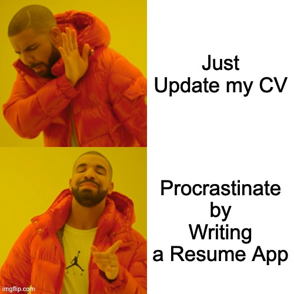

# Skip the Overhead: Lean Web Development with Django

### A Case Study in Simple, Maintainable Web Applications

--- <!-- Slide 1 -->

## Who am I?

> Be nice to us folks who wear glasses. We paid money to see you. --BobGolen

- Django Developer since 2013
- Python-Podcast Host
- Creator of [django-resume](https://github.com/ephes/django-resume)

--- <!-- Slide 2 -->

# What to Expect

> Developers are drawn to complexity like moths to a flame, often with the same result. --Neal Ford

- Why modern web development became so complex
- How to build interactive sites with less overhead
- A case study / demo with `django-resume`

--- <!-- Slide 3 -->

# The Mainstream Approach (Part 1)

> god: i have made a Single page webapp
>
> angels: you fucked up a perfectly good website is what you did. look at it. it’s got dependency
> injections. --[Eric Meyer](https://mastodon.social/@Meyerweb/111103984979396842)

- **Backend**
    - JSON/REST APIs
    - (Or, heaven forbid, GraphQL)
- **Frontend**
    - React/Vue/Angular + Store (Redux, Vuex, etc.)
- **CSS**
    - Tailwind or Bootstrap or another large framework
- **Build Pipeline**
    - TypeScript, Webpack/Vite, Babel

--- <!-- Slide 4 -->

# The Mainstream Approach (Part 2)

> “The Programmers’ Credo: we do these things not because they are easy, but because we thought they were going to be
> easy.” – [Pinboard](https://x.com/Pinboard/status/761656824202276864)

- Often split between **two or more teams** (backend vs. frontend)
- Deployed to **Kubernetes** or similar orchestration
- **Anecdote**: Tailwind build step scanning entire Python virtualenv → 40s build times
- **Result**: Seemingly small issues can balloon into major **productivity blockers**

--- <!-- Slide 5 -->

# Non-Functional Requirements: What We Really Want

- Smooth user experience
- Appealing visuals
- Developer experience

--- <!-- Slide 6 -->

# Achieving Modern Web Goals Without the Bloat

> Einstein repeatedly argued that there must be simplified explanations of nature, because God is not capricious or
> arbitrary. No such faith comforts the software engineer. --Fred Brooks

- Django
- htmx
- Modern CSS

--- <!-- Slide 7 -->
One of them will win!

--- <!-- Slide 8 -->

# django-resume: A Case Study in Lean Web Development

https://imgflip.com/memetemplates

--- <!-- Slide 9 -->

# Functional Requirements

> Technology is the art of arranging the world so we don't have to experience it.  --Max Frisch

- **Single Source of Truth**
    - Manage all resume content in one centralized system.

- **Easy Customization**
    - Adaptable to different professional needs:
        - Developers, academics, designers, and more.

--- <!-- Slide 10 -->

# Plugin Architecture

> Anything worth doing is worth doing badly. — G. K. Chesterton

- **Central `JSONField` for Plugin Data**
    - No additional models or migrations required.
    - Each plugin stores its data under its unique namespace in the `JSONField`.

- **Django Forms for Validation**
    - Define and validate the structure of plugin-specific data.

- **Templates for Rendering and Editing**
    - Render plugin data as HTML for display.
    - Provide user interfaces for editing plugin data.

--- <!-- Slide 11 -->

# Web Components for UI Edge Cases

> UIs are big, messy, mutable, stateful bags of
> sadness. --[Josh Abernathy](http://joshaber.github.io/2015/01/30/why-react-native-matters/)

- **Examples in django-resume**
    - <badge-editor>:
        - Handles dynamic lists (e.g., skills or tags)
        - Updates locally → Single server request on "Save"
    - <editable-form>:
        - Links `contenteditable=true` fields to hidden form inputs
        - Enables inline editing without custom form templates
- **Why Not SPAs?**
    - Web Components are:
        - Built into the browser → No extra JavaScript framework
        - Standards-based → Durable & future-proof

--- <!-- Slide 12 -->

# Leveraging LLMs for Automation

> Open source AI models will soon become unbeatable.
> Period. --[Yann LeCun](https://twitter.com/ylecun/status/1713304307519369704?s=12&t=7QYkNVuO9zKdwimgbPv89w)

> Journalism is making the same mistake with AI that they made with bloggers. They jumped to the incorrect conclusion
> that we were trying to do what they do. --[Dave Winer](https://mastodon.social/@davew/112379962302476793)

> ZIZEK: that AI will be the death of learning & so on; to this, I say NO! My student brings me their essay, which has
> been written by AI, & I plug it into my grading AI, & we are free! While the 'learning' happens, our superego satisfied,
> we are free now to learn whatever we want --[Zack Brown](https://x.com/LuminanceBloom/status/1600598003391266816)

- **Structured JSON Generation**

- **Streamlining Plugin Development**
    - Use LLMs to generate plugin boilerplate:
        - Forms, templates, and registry setup
        - Example prompt: "Create a plugin for certifications (name, issuer, date)"
    - Saves time and lowers the barrier for customization

--- <!-- Slide 13 -->

# Demo: django-resume in Action

1. **Overview of django-resume**
    - The admin interface for managing plugins and resume content.
    - Example plugins: Projects, Certifications, Skills.

2. **Showcasing Interactivity**
    - Adding a new plugin via the registry.
    - Using htmx for partial updates (e.g., editing a skill or certification inline).

3. **Web Components in Action**
    - Demonstrate `BadgeEditor` for dynamic lists.
    - Inline editing with `EditableForm` and `contenteditable=true`.

4. **Highlight Extensibility**
    - How new plugins fit seamlessly into the system.
    - JSONField data structure in action.

*Let’s see how django-resume keeps it simple yet powerful!*

--- <!-- Slide 14 -->

# Q&A & How to Stay in Touch

> The B in Benoit B. Mandelbrot stands for Benoit B.
> Mandelbrot. [Steve Lord](https://bladerunner.social/@stevelord/111127300258697213)

- **Questions?**

- **How to Get Involved**
    - Contribute to [django-resume on GitHub](https://github.com/ephes/django-resume)
    - Share feedback or suggest features.

- **Stay Connected**
    - GitHub: [ephes](https://github.com/ephes)
    - Fediverse: [@jochen@wersdoerfer.de](https://wersdoerfer.de/@jochen)
    - Podcast: [Python Podcast](https://python-podcast.de/show/)
    - Blog: [Ephes Blog](https://wersdoerfer.de/blogs/ephes_blog/)

# Quotes to use

> Everything that irritates us about others can lead us to an understanding of
> ourselves. --[Carl Jung](https://wist.info/jung-carl/39693/)

